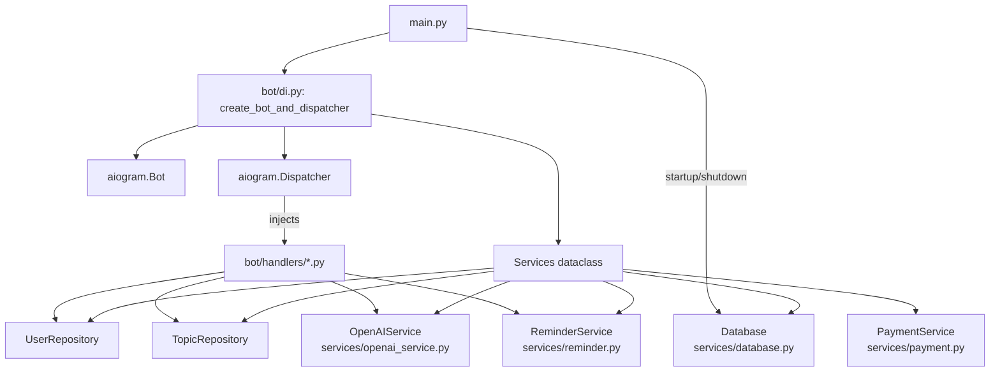
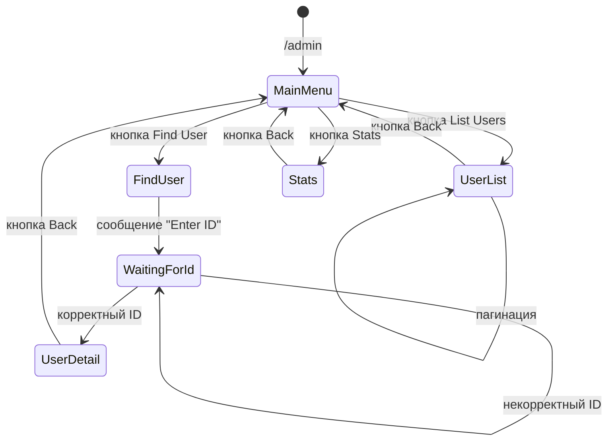
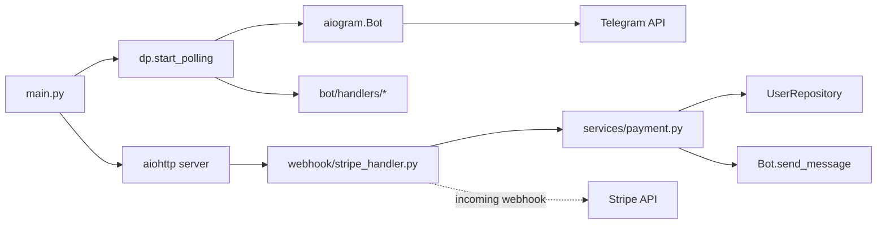
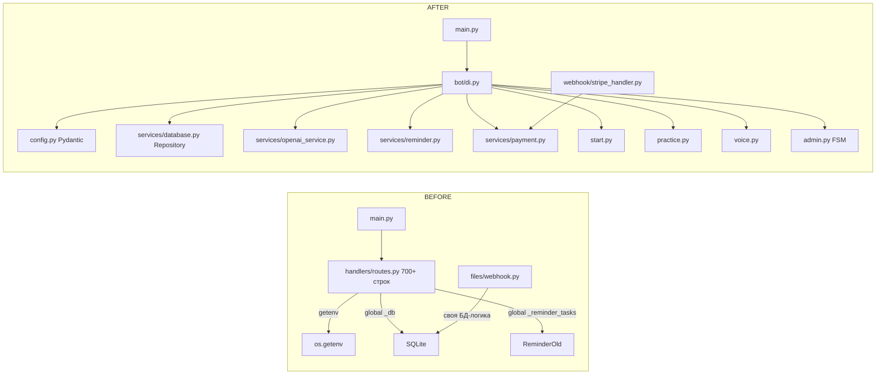
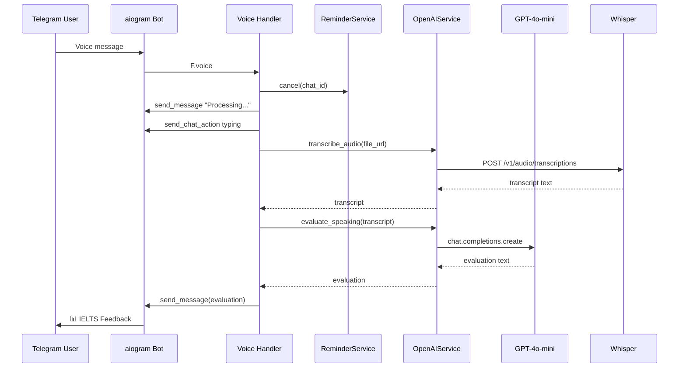
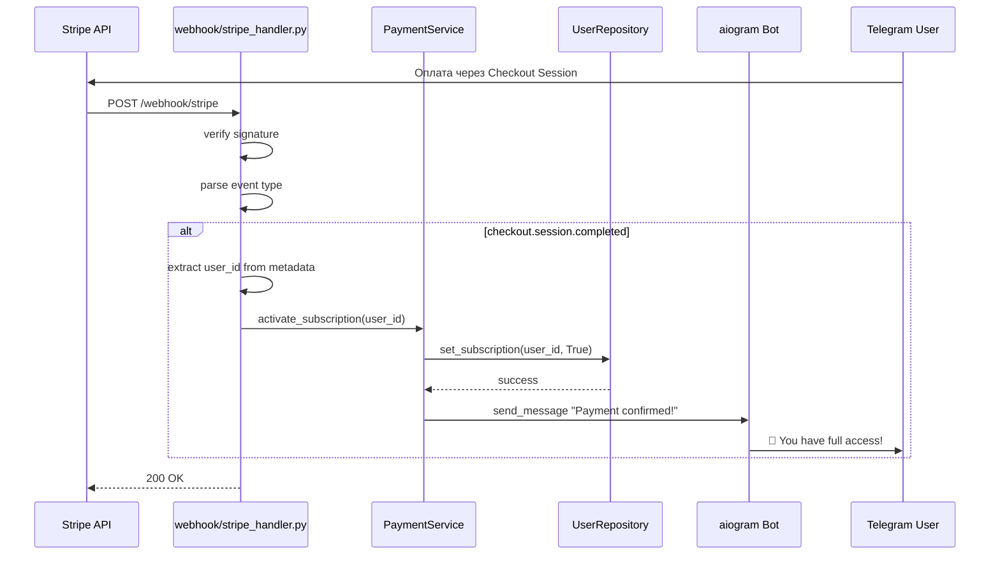

# REFACTORING PLAN — IELTS Speaking Practice Bot

> **Дата:** 2026-04-29  
> **Проект:** IELTS Speaking Practice Bot (aiogram 3.x + AsyncOpenAI + Stripe)  
> **Цель:** Модульная архитектура, DI, FSM, исправление багов, интеграция webhook

---

## Содержание

1. [Новая структура директорий](#1-новая-структура-директорий)
2. [Детальная спецификация модулей](#2-детальная-спецификация-модулей)
3. [Dependency Injection](#3-dependency-injection)
4. [FSM для админ-панели](#4-fsm-для-админ-панели)
5. [Интеграция webhook](#5-интеграция-webhook)
6. [Исправление багов](#6-исправление-багов)
7. [План миграции (пошагово)](#7-план-миграции-пошагово)
8. [Приложение: Схемы и диаграммы](#8-приложение-схемы-и-диаграммы)

---

## 1. Новая структура директорий

```
IELTS_Speaking_Practice_Bot/
│
├── .env.example                 # Шаблон .env без секретов
├── .gitignore                   # Обновлённый: *.db, .env, __pycache__, voice/, voices/
├── .python-version              # Опционально: фиксация версии Python
│
├── main.py                      # Точка входа (сборка DI-контейнера, запуск)
├── config.py                    # Pydantic Settings: все переменные окружения
├── requirements.txt             # Исправленный (без BOM, только прямые зависимости)
│
├── bot/
│   ├── __init__.py
│   ├── di.py                    # Фабрика Dependency Injection
│   ├── router.py                # Главный роутер (импортирует все хендлеры)
│   │
│   ├── handlers/
│   │   ├── __init__.py
│   │   ├── start.py             # /start, /support
│   │   ├── practice.py          # /practice, to_practice callback
│   │   ├── voice.py             # Обработка голосовых сообщений
│   │   ├── admin.py             # /admin, админ-панель (FSM)
│   │   ├── text.py              # Fallback на текстовые сообщения
│   │   └── errors.py            # Глобальный обработчик ошибок
│   │
│   └── keyboards/
│       ├── __init__.py
│       ├── admin_kb.py          # Inline-клавиатуры админки
│       └── common.py            # Общие клавиатуры
│
├── services/
│   ├── __init__.py
│   ├── database.py              # Подключение, репозитории
│   ├── openai_service.py        # GPT evaluation + Whisper transcription
│   ├── reminder.py              # Фоновые задачи напоминаний
│   └── payment.py               # Stripe webhook-логика + уведомления
│
├── webhook/
│   ├── __init__.py
│   ├── server.py                # aiohttp сервер для Stripe
│   └── stripe_handler.py        # Обработка Stripe-событий
│
├── tests/
│   ├── __init__.py
│   ├── conftest.py              # Pytest фикстуры (test DB, mock openai)
│   ├── test_database.py
│   ├── test_handlers.py
│   └── test_openai_service.py
│
└── scripts/
    ├── __init__.py
    └── seed_questions.py         # Скрипт заполнения БД вопросами
```

---

## 2. Детальная спецификация модулей

### 2.1 [`config.py`](config.py) — Конфигурация

**Назначение:** Единое место загрузки и валидации переменных окружения через Pydantic Settings. Устраняет разброс `getenv()` по всему проекту.

```python
from pydantic_settings import BaseSettings
from pydantic import Field

class Settings(BaseSettings):
    bot_token: str = Field(validation_alias="BOT_TOKEN")
    openai_key: str = Field(validation_alias="OPENAI_KEY")
    stripe_payment_link: str = Field(
        default="https://buy.stripe.com/your_link",
        validation_alias="STRIPE_PAYMENT_LINK"
    )
    stripe_webhook_secret: str = Field(
        default="",
        validation_alias="STRIPE_WEBHOOK_SECRET"
    )
    db_path: str = Field(default="ielts_bot.db", validation_alias="DB_PATH")
    admin_ids: list[int] = Field(default_factory=list, validation_alias="ADMIN_IDS")

    webhook_host: str = Field(default="0.0.0.0", validation_alias="WEBHOOK_HOST")
    webhook_port: int = Field(default=8080, validation_alias="WEBHOOK_PORT")

    free_attempts_limit: int = 2
    reminder_delay_seconds: int = 60

    model_config = {"env_file": ".env", "env_file_encoding": "utf-8"}

def get_settings() -> Settings:
    return Settings()  # type: ignore
```

**Классы/функции:**
- `Settings` — Pydantic-модель с валидацией
- `get_settings()` — фабрика для DI

**Зависимости:** `pydantic`, `pydantic-settings`

---

### 2.2 [`services/database.py`](services/database.py) — Репозитории БД

**Назначение:** Абстракция над aiosqlite. Репозитории для `users` и `topics`. Устраняет глобальный синглтон `_db` и дублирование SQL-запросов.

```python
from __future__ import annotations
import aiosqlite
from dataclasses import dataclass

@dataclass
class UserRecord:
    user_id: int
    free_attempts_used: int = 0
    subscription_active: bool = False
    created_at: str = ""

class Database:
    def __init__(self, db_path: str) -> None:
        self._db_path = db_path
        self._conn: aiosqlite.Connection | None = None

    async def connect(self) -> None:
        self._conn = await aiosqlite.connect(self._db_path, timeout=30)
        await self._conn.execute("PRAGMA journal_mode=DELETE")

    async def close(self) -> None:
        if self._conn:
            await self._conn.close()
            self._conn = None

    @property
    def conn(self) -> aiosqlite.Connection:
        if self._conn is None:
            raise RuntimeError("Database not connected")
        return self._conn

    async def init_schema(self) -> None:
        """Создаёт таблицы, если их нет."""
        # ... CREATE TABLE IF NOT EXISTS ...
        await self.conn.commit()

class UserRepository:
    def __init__(self, db: Database) -> None:
        self._db = db

    async def get_or_create(self, user_id: int) -> UserRecord: ...
    async def get_by_id(self, user_id: int) -> UserRecord | None: ...
    async def get_all(self, limit: int = 20, offset: int = 0) -> list[UserRecord]: ...
    async def increment_attempts(self, user_id: int) -> None: ...
    async def set_subscription(self, user_id: int, active: bool) -> bool: ...
    async def get_stats(self) -> dict: ...

class TopicRepository:
    def __init__(self, db: Database) -> None:
        self._db = db

    async def get_random_unused(self, user_id: int) -> str | None: ...
    async def seed_from_list(self, questions: list[str]) -> int: ...
```

**Классы/функции:**
- `Database` — управляет подключением к aiosqlite, инициализация схемы
- `UserRepository` — CRUD для пользователей, статистика
- `TopicRepository` — работа с топиками, получение случайного неиспользованного
- `UserRecord` — dataclass для типизации

**Зависимости:** `aiosqlite`, `config`

**Поток данных:**
```
Handler → UserRepository / TopicRepository → Database.conn → SQLite
```

---

### 2.3 [`services/openai_service.py`](services/openai_service.py) — OpenAI (GPT + Whisper)

**Назначение:** Инкапсуляция всех запросов к OpenAI. Генерация IELTS-топиков, транскрибация аудио, оценка speaking.

```python
from openai import AsyncOpenAI
import aiohttp
import io

class OpenAIService:
    def __init__(self, api_key: str) -> None:
        self._client = AsyncOpenAI(api_key=api_key)

    async def generate_topic(self) -> str:
        """Генерирует IELTS Speaking Part 2 topic через GPT-4o-mini."""

    async def transcribe_audio(self, file_url: str) -> str:
        """Скачивает аудио по URL и транскрибирует через Whisper."""

    async def evaluate_speaking(self, transcript: str) -> str:
        """Оценивает транскрипт по 4 критериям IELTS."""
```

**Классы/функции:**
- `OpenAIService` — все вызовы OpenAI
  - `generate_topic()` → возвращает текст топика
  - `transcribe_audio(file_url)` → возвращает транскрипт
  - `evaluate_speaking(transcript)` → возвращает оценку

**Зависимости:** `openai`, `aiohttp`, `config`

**Поток данных:**
```
VoiceHandler → OpenAIService.transcribe_audio() → file_url → Whisper → text
            → OpenAIService.evaluate_speaking(text) → GPT → feedback
```

---

### 2.4 [`services/reminder.py`](services/reminder.py) — Напоминания

**Назначение:** Управление фоновыми задачами напоминаний. Замена глобального `_reminder_tasks: dict`.

```python
import asyncio
from aiogram import Bot

REMINDER_TEXT = "🎙 Please start recording your answer now!..."

class ReminderService:
    def __init__(self) -> None:
        self._tasks: dict[int, asyncio.Task] = {}

    def schedule(self, bot: Bot, chat_id: int, delay: int = 60) -> None:
        """Создаёт/перезапускает задачу напоминания для chat_id."""
        self.cancel(chat_id)
        task = asyncio.create_task(self._send_after_delay(bot, chat_id, delay))
        self._tasks[chat_id] = task

    def cancel(self, chat_id: int) -> None:
        """Отменяет напоминание для chat_id (при получении голоса)."""
        task = self._tasks.pop(chat_id, None)
        if task and not task.done():
            task.cancel()

    async def _send_after_delay(self, bot: Bot, chat_id: int, delay: int) -> None:
        await asyncio.sleep(delay)
        try:
            await bot.send_message(chat_id=chat_id, text=REMINDER_TEXT)
        except Exception as e:
            logger.warning("[Reminder] Failed for %d: %s", chat_id, e)
```

**Классы/функции:**
- `ReminderService` — управление тасками
  - `schedule(bot, chat_id, delay)` — запланировать
  - `cancel(chat_id)` — отменить

**Зависимости:** `aiogram`, `asyncio`

---

### 2.5 [`services/payment.py`](services/payment.py) — Платежи

**Назначение:** Логика отметки пользователя как оплатившего и отправки уведомления.

```python
from services.database import UserRepository

class PaymentService:
    def __init__(self, user_repo: UserRepository, bot_token: str) -> None:
        self._user_repo = user_repo
        self._bot_token = bot_token

    async def activate_subscription(self, user_id: int) -> bool:
        """Устанавливает subscription_active=1 и уведомляет пользователя."""
        success = await self._user_repo.set_subscription(user_id, True)
        if success:
            await self._notify_user(user_id)
        return success

    async def _notify_user(self, user_id: int) -> None:
        """Отправляет confirmation message."""
```

**Классы/функции:**
- `PaymentService`
  - `activate_subscription(user_id)` → отмечает оплату + уведомление

**Зависимости:** `UserRepository`, `aiogram`

---

### 2.6 [`bot/handlers/start.py`](bot/handlers/start.py) — /start и /support

**Назначение:** Обработка команд `/start` и `/support`.

```python
from aiogram import Router
from aiogram.filters import Command
from aiogram.types import Message

router = Router()

@router.message(Command("start"))
async def cmd_start(message: Message) -> None:
    """Показывает приветствие и инструкции."""

@router.message(Command("support"))
async def cmd_support(message: Message) -> None:
    """Перенаправляет на cmd_start (или отдельный текст)."""
    await cmd_start(message)
```

**Зависимости:** `aiogram`

---

### 2.7 [`bot/handlers/practice.py`](bot/handlers/practice.py) — /practice

**Назначение:** Выдача топика пользователю, проверка лимита free attempts, запуск напоминания.

```python
from aiogram import Router, F, Bot
from aiogram.filters import Command
from aiogram.types import CallbackQuery, Message
from services.database import UserRepository, TopicRepository
from services.openai_service import OpenAIService
from services.reminder import ReminderService

router = Router()

@router.callback_query(lambda c: c.data == "to_practice")
async def to_practice_callback(callback: CallbackQuery) -> None: ...

@router.message(Command("practice"))
async def cmd_practice(
    message: Message,
    bot: Bot,
    user_repo: UserRepository,
    topic_repo: TopicRepository,
    openai_service: OpenAIService,
    reminder: ReminderService,
) -> None:
    # 1. Проверка лимита
    # 2. Получение топика (из БД или GPT)
    # 3. Инкремент попытки (если free)
    # 4. Запуск напоминания
    ...
```

**Зависимости:** `aiogram`, `services/*`

---

### 2.8 [`bot/handlers/voice.py`](bot/handlers/voice.py) — Голосовые сообщения

**Назначение:** Обработка голосовых сообщений: транскрибация → оценка → ответ.

```python
@router.message(F.voice)
async def process_audio(
    message: Message,
    bot: Bot,
    openai_service: OpenAIService,
    reminder: ReminderService,
) -> None:
    # 1. Отмена напоминания
    # 2. Скачивание файла
    # 3. Транскрибация
    # 4. Оценка GPT
    # 5. Ответ пользователю + typing indicator
    ...
```

**Зависимости:** `aiogram`, `OpenAIService`, `ReminderService`

---

### 2.9 [`bot/handlers/admin.py`](bot/handlers/admin.py) — Админ-панель (FSM)

**Назначение:** Административная панель с FSM. Замена ручного `_admin_waiting_for_user_id`.

Подробно — в разделе [FSM для админ-панели](#4-fsm-для-админ-панели).

---

### 2.10 [`bot/handlers/text.py`](bot/handlers/text.py) — Fallback

**Назначение:** Обработка входящего текста, не являющегося командой. Если пользователь не в FSM — игнорируем (или отвечаем, что команда неизвестна).

```python
@router.message(F.text & ~F.command)
async def handle_unknown_text(message: Message) -> None:
    """Просто игнорируем или шлём подсказку."""
```

---

### 2.11 [`bot/handlers/errors.py`](bot/handlers/errors.py) — Ошибки

**Назначение:** Глобальный обработчик исключений aiogram.

```python
from aiogram.types import ErrorEvent

@router.errors()
async def global_error_handler(event: ErrorEvent) -> bool:
    logger.error("Unhandled error: %s", event.exception)
    return True
```

---

### 2.12 [`bot/keyboards/admin_kb.py`](bot/keyboards/admin_kb.py) — Клавиатуры админки

**Назначение:** Фабрики inline-клавиатур для админ-панели.

```python
from aiogram.types import InlineKeyboardMarkup, InlineKeyboardButton

def admin_main_menu() -> InlineKeyboardMarkup: ...
def admin_user_list(users: list, offset: int, has_next: bool) -> InlineKeyboardMarkup: ...
def admin_user_detail(uid: int) -> InlineKeyboardMarkup: ...
```

---

### 2.13 [`bot/router.py`](bot/router.py) — Главный роутер

**Назначение:** Импортирует все роутеры хендлеров в один корневой роутер.

```python
from aiogram import Router

from bot.handlers import start, practice, voice, admin, text, errors

router = Router()
router.include_router(start.router)
router.include_router(practice.router)
router.include_router(voice.router)
router.include_router(admin.router)
router.include_router(text.router)
router.include_router(errors.router)
```

---

### 2.14 [`bot/di.py`](bot/di.py) — Dependency Injection

Подробно — в разделе [Dependency Injection](#3-dependency-injection).

---

### 2.15 [`webhook/server.py`](webhook/server.py) — aiohttp сервер

```python
from aiohttp import web
from webhook.stripe_handler import create_stripe_webhook_handler

async def run_webhook_server(
    webhook_host: str,
    webhook_port: int,
    stripe_webhook_secret: str,
    payment_service,
) -> None:
    app = web.Application()
    handler = create_stripe_webhook_handler(stripe_webhook_secret, payment_service)
    app.router.add_post("/webhook/stripe", handler)
    runner = web.AppRunner(app)
    await runner.setup()
    site = web.TCPSite(runner, webhook_host, webhook_port)
    await site.start()
    await asyncio.Event().wait()
```

---

### 2.16 [`webhook/stripe_handler.py`](webhook/stripe_handler.py) — Stripe handler

```python
def create_stripe_webhook_handler(stripe_secret: str, payment_service):
    async def handler(request: web.Request) -> web.Response:
        payload = await request.read()
        sig_header = request.headers.get("Stripe-Signature", "")
        # Верификация + обработка checkout.session.completed
        ...
    return handler
```

---

## 3. Dependency Injection

### 3.1 Проблема текущей архитектуры

Сейчас зависимости жёстко зашиты:
- `routes.py` сам создаёт `AsyncOpenAI(client)`, сам читает `getenv()`, сам управляет `_db`
- Webhook создаёт свой собственный `Bot(token=...)` при каждом уведомлении

### 3.2 Решение: DI через aiogram 3 `Dispatcher` + фабрика

aiogram 3 поддерживает DI через параметры хендлеров. Мы создадим центральную фабрику, которая инициализирует все сервисы и "продаёт" их в `main.py`.

```python
# bot/di.py
from dataclasses import dataclass
from aiogram import Bot, Dispatcher
from config import Settings
from services.database import Database, UserRepository, TopicRepository
from services.openai_service import OpenAIService
from services.reminder import ReminderService
from services.payment import PaymentService
from bot.router import router

@dataclass
class Services:
    """Контейнер всех сервисов."""
    settings: Settings
    db: Database
    user_repo: UserRepository
    topic_repo: TopicRepository
    openai: OpenAIService
    reminder: ReminderService
    payment: PaymentService

def create_bot_and_dispatcher(settings: Settings) -> tuple[Bot, Dispatcher, Services]:
    """Фабрика — создаёт Bot, Dispatcher и все сервисы."""
    bot = Bot(token=settings.bot_token)

    # Сервисы
    db = Database(settings.db_path)
    user_repo = UserRepository(db)
    topic_repo = TopicRepository(db)
    openai = OpenAIService(settings.openai_key)
    reminder = ReminderService()
    payment = PaymentService(user_repo, settings.bot_token)

    services = Services(
        settings=settings,
        db=db,
        user_repo=user_repo,
        topic_repo=topic_repo,
        openai=openai,
        reminder=reminder,
        payment=payment,
    )

    # DI: регистрируем сервисы как глобальные зависимости dispatcher
    dp = Dispatcher()
    dp["services"] = services
    dp["user_repo"] = user_repo
    dp["topic_repo"] = topic_repo
    dp["openai"] = openai
    dp["reminder"] = reminder
    dp["payment"] = payment

    dp.include_router(router)

    return bot, dp, services
```

### 3.3 Использование DI в хендлерах

```python
# bot/handlers/practice.py
@router.message(Command("practice"))
async def cmd_practice(
    message: Message,
    bot: Bot,
    user_repo: UserRepository,      # инжектится из dp["user_repo"]
    topic_repo: TopicRepository,    # инжектится из dp["topic_repo"]
    openai_service: OpenAIService,  # инжектится из dp["openai"]
    reminder: ReminderService,      # инжектится из dp["reminder"]
) -> None:
    ...
```

**Как это работает:** aiogram 3 автоматически матчит типы параметров хендлера с зарегистрированными в `Dispatcher` объектами по ключу. Если имя параметра совпадает с ключом — объект инжектируется.

---

### 3.4 Схема DI



---

## 4. FSM для админ-панели

### 4.1 Проблема текущей реализации

Сейчас используется глобальный словарь `_admin_waiting_for_user_id = {}` для отслеживания, что админ ввёл команду `/admin_find_user` и ожидает ввода ID. Это race-condition-небезопасно и не масштабируется.

### 4.2 Решение: aiogram FSM (Finite State Machine)

```python
# bot/handlers/admin.py
from aiogram.fsm.state import StatesGroup, State
from aiogram.fsm.context import FSMContext

class AdminFindUser(StatesGroup):
    waiting_for_user_id = State()

class AdminChangeSubscription(StatesGroup):
    waiting_for_user_id = State()
    confirming = State()
```

### 4.3 Полный код админ-хендлера с FSM

```python
import logging
from aiogram import Router, F
from aiogram.filters import Command, StateFilter
from aiogram.fsm.context import FSMContext
from aiogram.fsm.state import StatesGroup, State
from aiogram.types import Message, CallbackQuery
from services.database import UserRepository, UserRecord

logger = logging.getLogger(__name__)
router = Router()

# ----- States -----

class AdminFindUser(StatesGroup):
    waiting_for_user_id = State()

# ----- Guards -----

def _is_admin(user_id: int, admin_ids: list[int]) -> bool:
    return user_id in admin_ids

# ----- /admin -----

@router.message(Command("admin"))
async def admin_panel(
    message: Message,
    admin_ids: list[int],
    user_repo: UserRepository,
) -> None:
    if not _is_admin(message.from_user.id, admin_ids):
        await message.answer("⛔ Access denied.")
        return
    # Показываем меню
    await message.answer(
        "👑 Admin panel\nChoose an action:",
        reply_markup=admin_main_menu(),
    )

# ----- Find user flow (FSM) -----

@router.callback_query(lambda c: c.data == "admin_find_user")
async def admin_find_user_start(
    callback: CallbackQuery,
    state: FSMContext,
    admin_ids: list[int],
) -> None:
    if not _is_admin(callback.from_user.id, admin_ids):
        await callback.answer("Access denied")
        return
    await callback.message.answer("Enter user ID in digits:")
    await state.set_state(AdminFindUser.waiting_for_user_id)
    await callback.answer()

@router.message(AdminFindUser.waiting_for_user_id, F.text)
async def admin_find_user_process(
    message: Message,
    state: FSMContext,
    user_repo: UserRepository,
) -> None:
    try:
        uid = int(message.text.strip())
    except ValueError:
        await message.answer("Invalid ID. Enter a number.")
        return

    user = await user_repo.get_by_id(uid)
    if not user:
        await message.answer(f"❌ User {uid} not found.")
    else:
        text = (
            f"🆔 ID: `{user.user_id}`\n"
            f"🎫 Attempts: {user.free_attempts_used}\n"
            f"💳 Subscription: {'✅ active' if user.subscription_active else '❌ inactive'}\n"
            f"📅 Registered: {user.created_at}\n"
        )
        await message.answer(text, parse_mode="Markdown", reply_markup=admin_user_detail(uid))

    await state.clear()

# ----- List users (paginated) -----

@router.callback_query(lambda c: c.data.startswith("admin_list_users"))
async def admin_list_users(
    callback: CallbackQuery,
    user_repo: UserRepository,
    admin_ids: list[int],
) -> None:
    if not _is_admin(callback.from_user.id, admin_ids):
        await callback.answer("Access denied")
        return
    offset = 0
    users = await user_repo.get_all(limit=5, offset=offset)
    next_users = await user_repo.get_all(limit=1, offset=offset + 5)
    await callback.message.edit_text(
        format_user_list(users),
        parse_mode="Markdown",
        reply_markup=admin_user_list(users, offset, bool(next_users)),
    )
    await callback.answer()

# ----- Toggle subscription -----

@router.callback_query(lambda c: c.data.startswith("admin_toggle_"))
async def admin_toggle_subscription(
    callback: CallbackQuery,
    user_repo: UserRepository,
    admin_ids: list[int],
) -> None:
    if not _is_admin(callback.from_user.id, admin_ids):
        await callback.answer("Access denied")
        return
    uid = int(callback.data.split("_")[2])
    user = await user_repo.get_by_id(uid)
    if not user:
        await callback.answer("User not found", show_alert=True)
        return
    new_status = not user.subscription_active
    await user_repo.set_subscription(uid, new_status)
    await callback.answer(
        f"Subscription for {uid}: {'active' if new_status else 'inactive'}"
    )
    # Обновляем список
    # (повторяем логику admin_list_users или сохраняем offset в callback_data)
```

### 4.4 Схема FSM-переходов



---

## 5. Интеграция webhook

### 5.1 Текущая проблема

[`files/webhook.py:146`](files/webhook.py:146) — сервер запускается отдельным процессом, не интегрирован с [`main.py`](main.py). Более того, `webhook.py` загружает `.env` сам (строка 43), имеет свою БД-логику и обновляет колонку `is_paid`, которой нет в схеме (баг **BUG-02**).

### 5.2 Решение: asyncio.gather()

Запускаем aiohttp сервер рядом с aiogram polling'ом в одном event loop через `asyncio.gather()`.

```python
# main.py (новая версия)
import asyncio
import logging
from config import get_settings
from bot.di import create_bot_and_dispatcher
from webhook.server import run_webhook_server

logging.basicConfig(
    level=logging.INFO,
    format="%(asctime)s [%(levelname)s] %(name)s: %(message)s",
)

async def main() -> None:
    settings = get_settings()
    bot, dp, services = create_bot_and_dispatcher(settings)

    # Инициализация
    await services.db.connect()
    await services.db.init_schema()

    # Запуск
    async def polling():
        await dp.start_polling(bot)

    async def webhook():
        await run_webhook_server(
            webhook_host=settings.webhook_host,
            webhook_port=settings.webhook_port,
            stripe_webhook_secret=settings.stripe_webhook_secret,
            payment_service=services.payment,
        )

    logging.info("Bot + Webhook starting...")
    try:
        await asyncio.gather(polling(), webhook())
    finally:
        await services.db.close()
        await bot.session.close()

if __name__ == "__main__":
    asyncio.run(main())
```

### 5.3 Альтернатива: отдельный процесс

Если нужна изоляция (например, вебхук на продакшене за nginx), можно оставить отдельный entrypoint:

```python
# run_webhook.py
import asyncio
from config import get_settings
from bot.di import create_bot_and_dispatcher
from webhook.server import run_webhook_server

async def main():
    settings = get_settings()
    _, _, services = create_bot_and_dispatcher(settings)
    await services.db.connect()
    await services.db.init_schema()
    await run_webhook_server(...)

asyncio.run(main())
```

### 5.4 Схема запуска



---

## 6. Исправление багов

### 6.1 BUG-02: `is_paid` → `subscription_active`

**Проблема:** [`files/webhook.py:60`](files/webhook.py:60) обновляет колонку `UPDATE users SET is_paid = 1`, но в схеме БД колонка называется `subscription_active`.

**Исправление:**
1. Webhook больше не имеет собственной БД-логики — он использует `PaymentService`, который вызывает `UserRepository.set_subscription()`, работающий с `subscription_active`.
2. Если в существующей БД нет колонки `is_paid` — проблема исчезает автоматически.
3. **Если колонка `is_paid` существует** — добавить миграцию: `ALTER TABLE users DROP COLUMN is_paid;` (SQLite 3.35+ поддерживает DROP COLUMN).

```sql
-- Миграция (если колонка is_paid существует)
ALTER TABLE users DROP COLUMN is_paid;
```

### 6.2 BUG-03: DB_PATH не консистентен

**Проблема:**
- [`handlers/routes.py:22`](handlers/routes.py:22): `DB_PATH = getenv("DB_PATH", "bot.sql")`
- [`files/webhook.py:46`](files/webhook.py:46): `DB_PATH = getenv("DB_PATH", "bot.db")`
- `.env` содержит `DB_PATH=ielts_bot.db`
- Файл БД реально называется `ielts_bot.db`

**Исправление:**
- Единый `Settings.db_path` в [`config.py`](config.py) со значением по умолчанию `"ielts_bot.db"`
- Все модули получают `db_path` из `Settings`, а не из `getenv()`

### 6.3 SEC-01: Секреты в репозитории

**Проблема:** `.env` с `BOT_TOKEN` и `OPENAI_KEY` в репозитории.

**Исправление:**
- Обновить [`.gitignore`](.gitignore):
  ```
  .env
  *.db
  __pycache__/
  voice/
  voices/
  *.pyc
  .venv*/
  ```
- Создать [`.env.example`](.env.example):
  ```
  BOT_TOKEN=
  OPENAI_KEY=
  STRIPE_PAYMENT_LINK=https://buy.stripe.com/your_link
  STRIPE_WEBHOOK_SECRET=
  DB_PATH=ielts_bot.db
  ADMIN_IDS=123456789,987654321
  WEBHOOK_HOST=0.0.0.0
  WEBHOOK_PORT=8080
  ```

### 6.4 CQ-01: requirements.txt повреждён

**Проблема:** Файл содержит BOM-символы (UTF-16 BOM `\uFEFF` перед каждым символом).

**Исправление:** Переписать [`requirements.txt`](requirements.txt) с нуля, указав только прямые зависимости:

```
aiogram==3.27.0
aiohttp==3.13.5
aiosqlite==0.22.1
openai==2.32.0
python-dotenv==1.2.2
stripe==11.0.0
pydantic-settings==2.12.0
```

### 6.5 CQ-02: /support вызывает /start

**Проблема:** [`handlers/routes.py:354`](handlers/routes.py:354) — `/support` полностью дублирует `/start`.

**Решение:** Оставить как есть (сознательное решение для UX) — это допустимо. Вынести текст приветствия в константу.

### 6.6 CQ-03: Магическое число 5

**Проблема:** [`handlers/routes.py:520`](handlers/routes.py:520) — `limit=5` жёстко зашито в пагинации.

**Решение:** Вынести в константу `ADMIN_PAGE_SIZE = 5` в `config.py` или на уровне модуля.

### 6.7 CQ-06: Неиспользуемая gTTS

Удалить `gTTS` из `requirements.txt` — она не используется в текущей версии.

### 6.8 CQ-07, CQ-08: Мёртвый код и папки

- Удалить папки [`voice/`](voice/), [`voices/`](voices/)
- Удалить файлы:
  - [`handlers/routes — 14-01.py`](handlers/routes%20—%2014-01.py)
  - [`handlers/routes — old.py`](handlers/routes%20—%20old.py)
  - [`handlers/routes-24-04.py`](handlers/routes-24-04.py)

---

## 7. План миграции (пошагово)

### Шаг 1: Подготовка (backup + безопасность)

1. Сделать копию всей папки проекта (backup).
2. Создать `.env.example` и обновить `.gitignore`.
3. Убедиться, что `.env` добавлен в `.gitignore` (уже есть, но проверить).
4. Создать дамп БД: скопировать `ielts_bot.db` в `ielts_bot.db.backup`.

### Шаг 2: Создание новой структуры (без удаления старой)

1. Создать папки:
   - `bot/`, `bot/handlers/`, `bot/keyboards/`
   - `services/`
   - `webhook/`
   - `tests/`
   - `scripts/`
2. Написать файлы:
   - `bot/__init__.py`, `bot/handlers/__init__.py`, `bot/keyboards/__init__.py`
   - `services/__init__.py`, `webhook/__init__.py`, `tests/__init__.py`, `scripts/__init__.py`

### Шаг 3: Написание core-модулей

1. [`config.py`](config.py) — Pydantic Settings
2. [`services/database.py`](services/database.py) — Database, UserRepository, TopicRepository
3. [`services/openai_service.py`](services/openai_service.py) — OpenAIService
4. [`services/reminder.py`](services/reminder.py) — ReminderService
5. [`services/payment.py`](services/payment.py) — PaymentService

### Шаг 4: Написание хендлеров

1. [`bot/handlers/start.py`](bot/handlers/start.py)
2. [`bot/handlers/practice.py`](bot/handlers/practice.py)
3. [`bot/handlers/voice.py`](bot/handlers/voice.py)
4. [`bot/handlers/admin.py`](bot/handlers/admin.py) — с FSM
5. [`bot/handlers/text.py`](bot/handlers/text.py)
6. [`bot/handlers/errors.py`](bot/handlers/errors.py)

### Шаг 5: Написание клавиатур

1. [`bot/keyboards/admin_kb.py`](bot/keyboards/admin_kb.py)
2. [`bot/keyboards/common.py`](bot/keyboards/common.py)

### Шаг 6: Webhook

1. [`webhook/server.py`](webhook/server.py)
2. [`webhook/stripe_handler.py`](webhook/stripe_handler.py)

### Шаг 7: DI и точка входа

1. [`bot/di.py`](bot/di.py) — фабрика сервисов
2. [`bot/router.py`](bot/router.py) — сборка роутеров
3. Обновить [`main.py`](main.py) — использование DI, asyncio.gather

### Шаг 8: Исправление requirements.txt

Переписать [`requirements.txt`](requirements.txt) (без BOM, только прямые зависимости).

### Шаг 9: Тестирование новой структуры

1. Убедиться, что импорты работают: `python -c "from config import get_settings; print('OK')"`
2. Запустить бота в тестовом режиме (с пустым `.env` или тестовым токеном).
3. Проверить все команды: `/start`, `/practice`, `/admin`.
4. Проверить обработку голосового сообщения (можно заглушкой OpenAI).
5. Проверить FSM-админку.

### Шаг 10: Удаление старого кода

1. Удалить [`handlers/routes.py`](handlers/routes.py) — ТОЛЬКО после подтверждения, что новая структура работает.
2. Удалить мёртвые файлы (старые версии `routes`).
3. Удалить папки [`voice/`](voice/), [`voices/`](voices/).
4. Перенести [`files/webhook.py`](files/webhook.py) в `webhook/` (или удалить, если новая версия готова).
5. Перенести [`files/seed_questions.py`](files/seed_questions.py) в `scripts/seed_questions.py`.

### Шаг 11: Финальные проверки

1. Удалить `gTTS` из зависимостей.
2. Проверить `.gitignore`.
3. Переименовать/удалить `files/` если он пуст.
4. Запустить полный тест-сьют (если тесты написаны).

---

## 8. Приложение: Схемы и диаграммы

### 8.1 Сравнение архитектур "До" и "После"



### 8.2 Поток обработки голосового сообщения



### 8.3 Поток обработки платежа (Stripe Webhook)



---

*Конец документа. План готов к реализации.*

*Рекомендуемый следующий шаг: открыть [`REFACTORING_PLAN.md`](REFACTORING_PLAN.md) в режиме Code для пошаговой реализации.*
